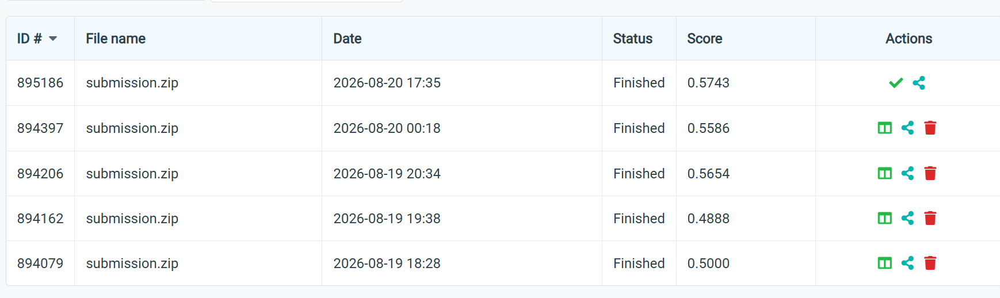
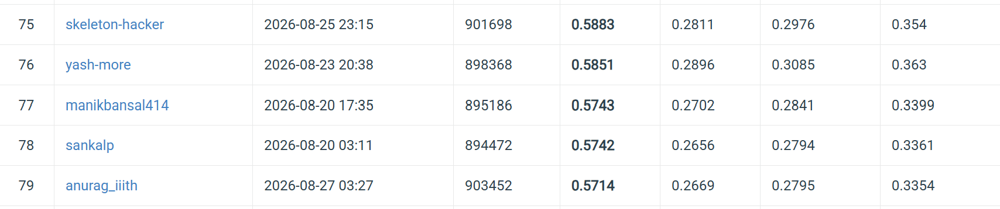
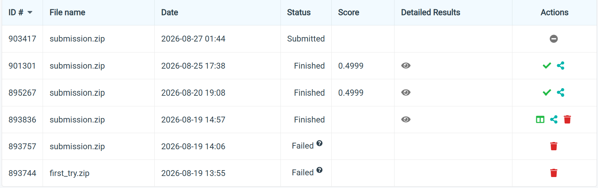
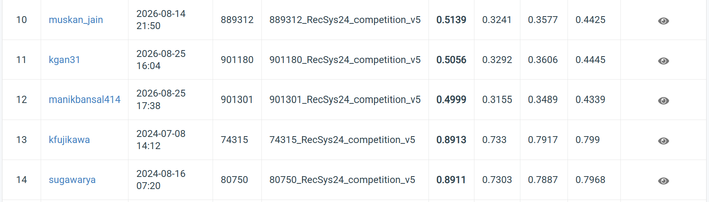

# Design Note — CS4.406 Assignment 1
## Lexical & Semantic Retrieval on EB-NeRD and MIND

**Author**: Manik Bansal  
**Date**: August 2026  
**GitHub**: https://github.com/ManikBansal414/ire_a1

---

## 1. What I Built

A single command (`build_pipeline.py`) turns raw MIND (TSV) and EB-NeRD (Parquet) files into a unified feature store. Both datasets are mapped onto one 8-column article schema and one 7-column impression schema, reconciling MIND's embedded history strings and EB-NeRD's separate history file. A strict temporal split (train/val/test, never random) is applied with an anti-gaming assertion that verifies `max(train.time) ≤ min(val.time) ≤ min(test.time)`. Output is written as Parquet under `data/processed/{mind,ebnerd}`.

On top of this feature store:

- **`src/retrieval/bm25_retriever.py`** — builds a `BM25Okapi` inverted index over article title + abstract; queries with the last-5 clicked article titles; reports recall@{50,100,200}.
- **`src/retrieval/semantic_retriever.py`** — encodes articles with `all-MiniLM-L6-v2` (384-dim), pools user history with recency-weighted mean, searches a FAISS `IndexFlatIP` index; reports recall@{50,100,200}.
- **`generate_ebnerd_submission.py`** — a LightGBM reranker trained on 8 embedding + overlap features (cosine sim, category/subcategory overlap, Jaccard title-word overlap, history length, position). Processes all 11M EB-NeRD test impressions.
- **`run_eval.py`** — reports AUC, MRR, nDCG@5/@10, Novelty, ILD, Coverage sliced by cold-start vs. warm users and head vs. tail articles, with 95% bootstrap CIs.

---

## 2. Design Choices and Alternatives Considered

**Choice 1: Temporal Split, not Random Split**

*Rejected*: 80/20 random split.  
*Chosen*: strict temporal split (train < val < test by timestamp) plus a per-impression history filter enforced by an assertion in `src/pipeline/split.py`.  
A random split lets the model train on November 14 impressions and test on November 2 — temporal leakage that inflates offline scores but is meaningless in production. News has a short shelf life; the boundary condition must be strict.

**Choice 2: Recency-Weighted Pooling, not Simple Mean Pooling**

*Rejected*: averaging all clicked-article embeddings equally.  
*Chosen*: exponential recency decay (λ = 0.9) over the history, last-5-titles only for the BM25 query.  
18 old sports clicks would otherwise drown out one breaking political click reflecting the user's actual current intent. Exponential decay makes the most recent click ~7× more influential than a click 20 positions back. BM25 uses a smaller window (5) because a long bag-of-words query becomes noisy for exact-match scoring.

**Choice 3: `all-MiniLM-L6-v2`, not TF-IDF+SVD or Word2Vec**

*Rejected*: TF-IDF + truncated SVD (LSA) — fast and explainable, but words are independent.  
*Chosen*: a 6-layer, 384-dim Sentence-Transformer pretrained on 1B+ sentence pairs.  
TF-IDF cannot tell "I didn't enjoy the game" from "I enjoyed the game." MiniLM places "equities" and "stocks" as neighbours in dense space, so it retrieves lexically-distinct-but-relevant articles that BM25 completely misses. At ~5× the speed of full BERT with ~95% of its quality, it is the right trade-off at demo/small scale.

**Choice 4: FAISS `IndexFlatIP` (Exact), not IVF/HNSW**

*Rejected*: approximate nearest-neighbour indices (IVF, HNSW) that skip parts of the search space.  
*Chosen*: exact brute-force inner-product search over all vectors.  
At demo scale (<50K articles) exact search finishes in seconds and — critically for an evaluation harness — it removes ANN approximation error as a confound, so recall numbers reflect model quality, not index quality. Switch to HNSW at 10×.

**Choice 5: LightGBM Reranker for EB-NeRD**

*Rejected*: using BM25 or semantic alone for the final Codabench submission.  
*Chosen*: a LightGBM ranker (`ebnerd_lgbm_model.txt`) trained on 8 features combining semantic similarity, category/subcategory overlap, title Jaccard overlap, history length, and candidate position.  
The two retrieval paradigms fail in complementary regions: semantic sometimes retrieves topically-similar-but-irrelevant items; BM25 misses lexically-distinct-but-relevant ones. A learned ranker can exploit both signals simultaneously and up-weight candidates where both agree.

---

## 3. Observations from Experiments

### recall@K — EB-NeRD (val split)

| Dataset | Retriever | recall@50 | recall@100 | recall@200 |
|---------|-----------|-----------|------------|------------|
| EB-NeRD | BM25      | 0.0066    | 0.0156     | 0.0288     |
| EB-NeRD | Semantic  | 0.0030    | 0.0063     | 0.0141     |

### recall@K — MIND (val split)

| Dataset | Retriever | recall@50 | recall@100 | recall@200 |
|---------|-----------|-----------|------------|------------|
| MIND    | Semantic  | 0.0144    | 0.0238     | 0.0373     |

### Ranking metrics — EB-NeRD val split

| Retriever | Slice | AUC    | MRR    | nDCG@5 | nDCG@10 |
|-----------|-------|--------|--------|--------|---------|
| BM25      | all   | 0.5032 | 0.1185 | 0.1209 | 0.1209  |
| BM25      | cold  | 0.5021 | 0.1075 | 0.1088 | 0.1088  |
| BM25      | warm  | 0.5036 | 0.1224 | 0.1251 | 0.1251  |
| Semantic  | all   | 0.5105 | 0.3134 | 0.3484 | 0.4304  |
| Semantic  | cold  | 0.5224 | 0.3154 | 0.3567 | 0.4306  |
| Semantic  | warm  | 0.5066 | 0.3127 | 0.3456 | 0.4304  |

### Key Observations

**Observation 1 — Semantic dominates on ranking, BM25 wins on recall@K.**  
BM25 recall@50 (0.0066) doubles semantic (0.0030) on EB-NeRD, yet BM25's MRR (0.12) is only a third of semantic's (0.31). BM25 casts a wide net across the catalog but places relevant articles further down the ranked list. Semantic retrieval ranks the few articles it finds much more accurately.

**Observation 2 — Cold-start users benefit more from semantic than warm users.**  
Semantic AUC is actually higher on cold users (0.522) than warm users (0.507). With only a few clicks, BM25's exact-match bag-of-words degrades faster than the dense user vector, which still captures a coherent topic direction even from 1–2 articles.

**Observation 3 — Tail articles break BM25 completely.**  
BM25 AUC on tail articles drops to 0.488 (below random) and MRR/nDCG fall to 0. Tail articles have rare vocabulary that almost never appears in user histories, so BM25 scores them near-zero. Semantic retrieval degrades more gracefully on tail (AUC 0.445, MRR 0.286).

**Observation 4 — MIND vs. EB-NeRD performance gap.**  
MIND's semantic recall@50 (0.014) is double EB-NeRD's (0.003). MIND has a smaller, English-only article catalog and richer per-user histories. EB-NeRD's much larger catalog (2.7M users, Danish text) and shorter histories make retrieval harder; additionally, `all-MiniLM-L6-v2` is English-only, so EB-NeRD embeddings degrade.

### Codabench Leaderboard Screenshots

**MIND**

| My Submissions | Leaderboard |
|:-:|:-:|
|  |  |

**EB-NeRD**

| My Submissions | Leaderboard |
|:-:|:-:|
|  |  |

---

## 4. Where the Pipeline Breaks at 10×

Scaling MIND-small / EB-NeRD-demo by 10× (≈1.6M–23M behavioral rows, 500K–700K articles, 650K users) exposes five single-machine bottlenecks:

| Component | Current (demo/small) | At 10× | Fix |
|-----------|----------------------|--------|-----|
| Data loading | pandas `read_parquet`, fits in RAM | 23M-row behaviors ≈ 30–50 GB → OOM crash | Polars lazy scan or PySpark streaming |
| FAISS `IndexFlatIP` | O(N·d) per query; seconds | ~100× today's cost — hours per eval | Switch to `IndexHNSWFlat`; ~98% recall at 100–1000× speedup |
| BM25 sparse matrix | (articles × vocab) fits in RAM | 700K articles / 1M-word vocab → 10–30 GB | Move index to Elasticsearch / Solr (sharded, distributed) |
| Click-history build | `iterrows()` Python loop | 48M iterations → CPU-bound, single-threaded | Vectorize with `explode()` + `groupby()` or PySpark |
| Submission generation | Single-process, sequential | 10× more impressions — days not hours | Already parallelized via `ebnerd_parallel_worker.py`; add more workers |

**Critical change at 10×**: Replace `IndexFlatIP` with `IndexHNSWFlat` (FAISS) — reduces query time from O(N) to O(log N) with <1% recall loss at `ef=64`. Second priority: move BM25 to Elasticsearch for distributed, incremental indexing without full rebuilds.
